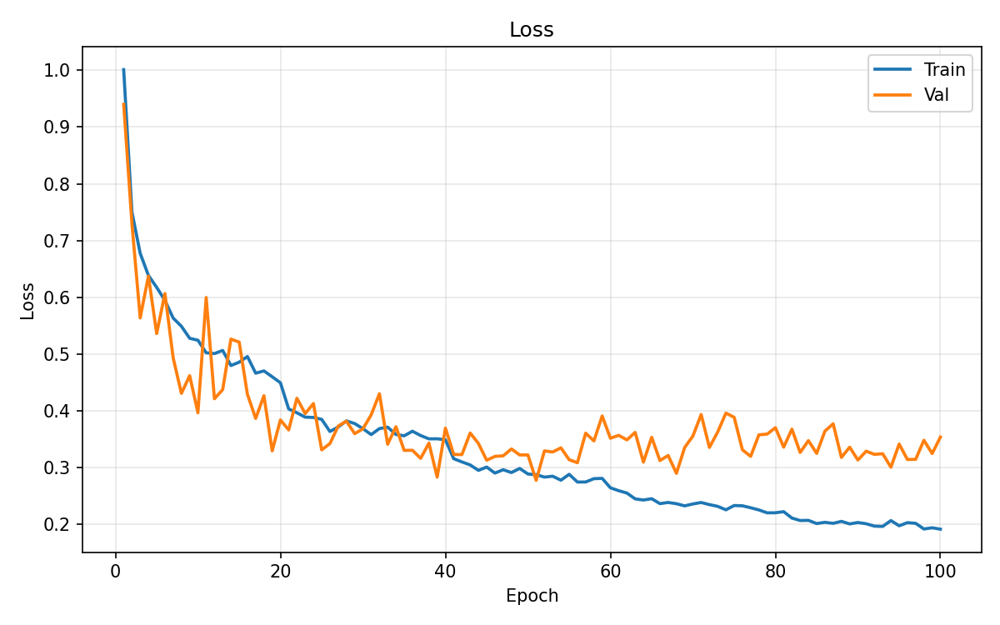
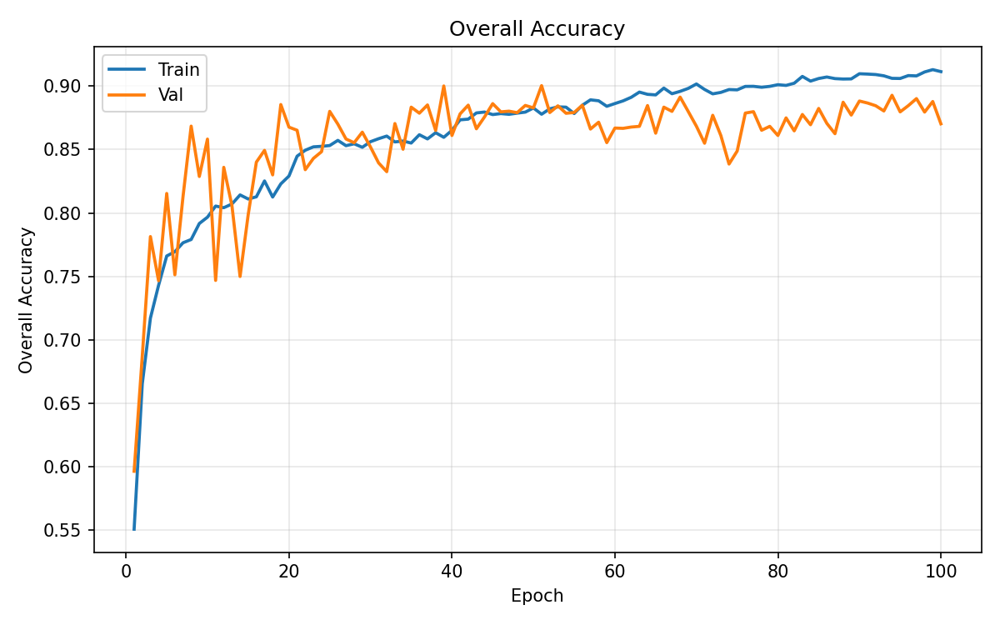
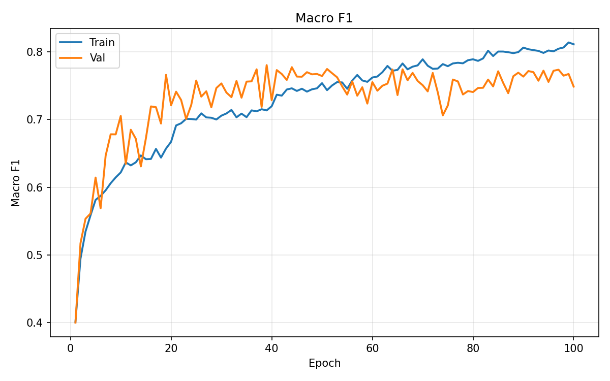
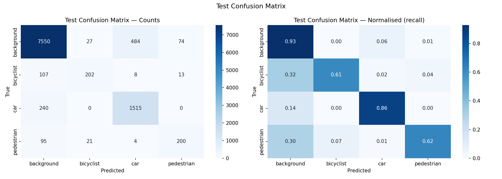
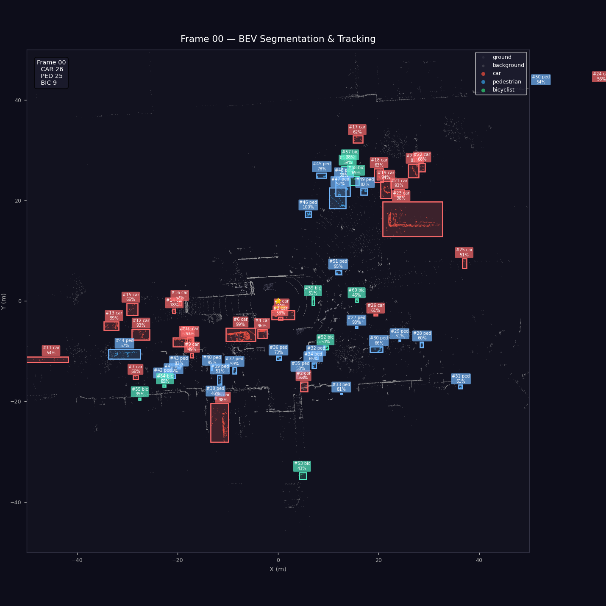
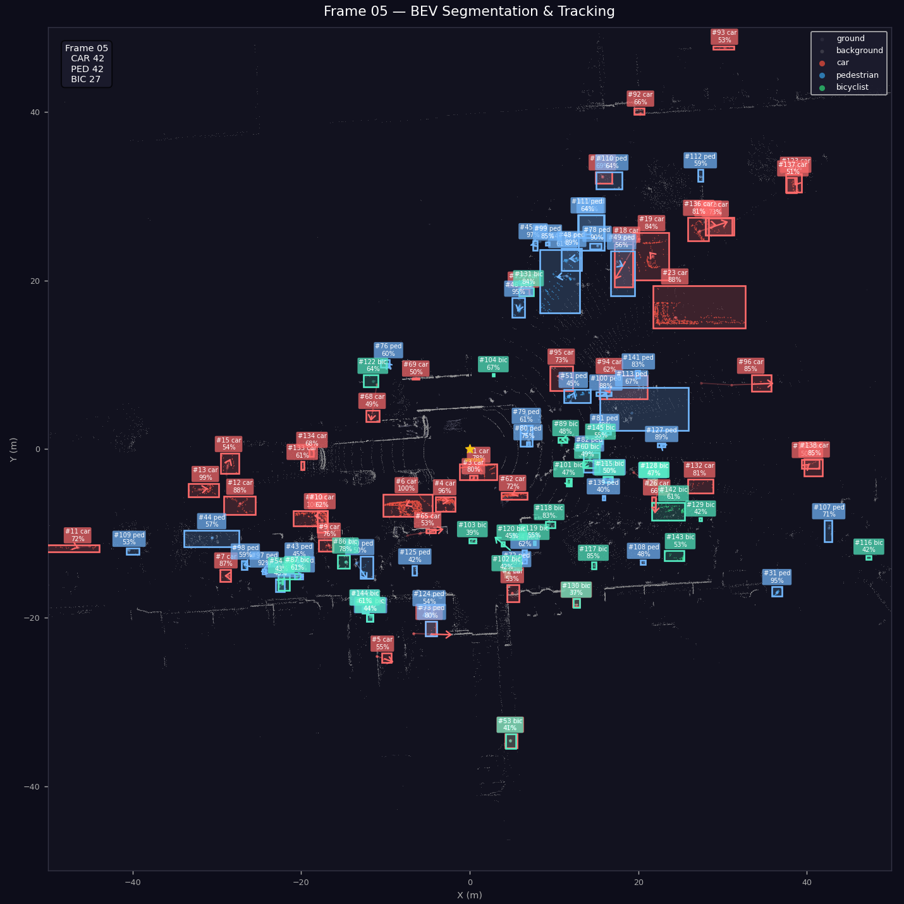
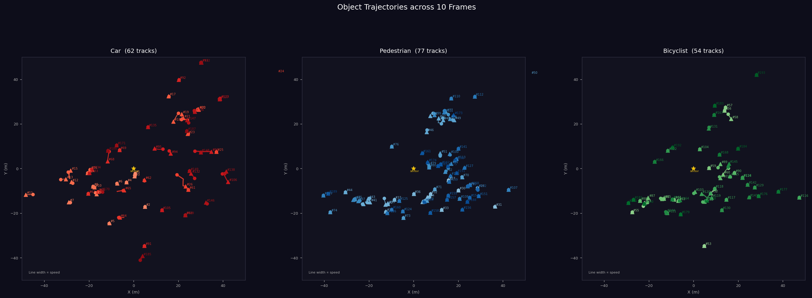
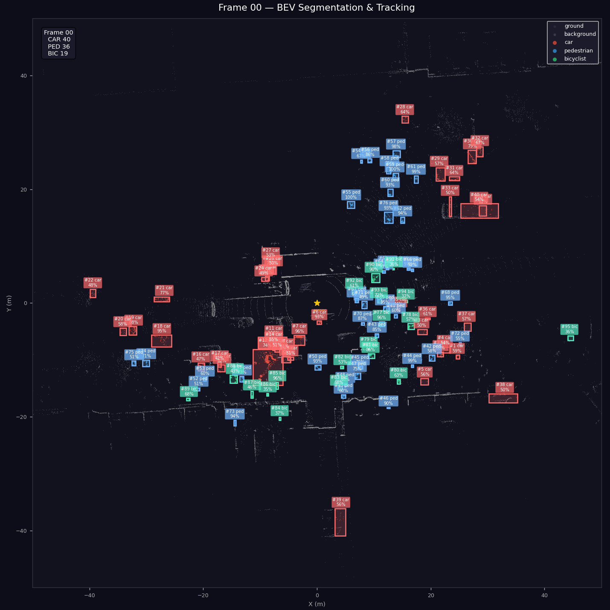
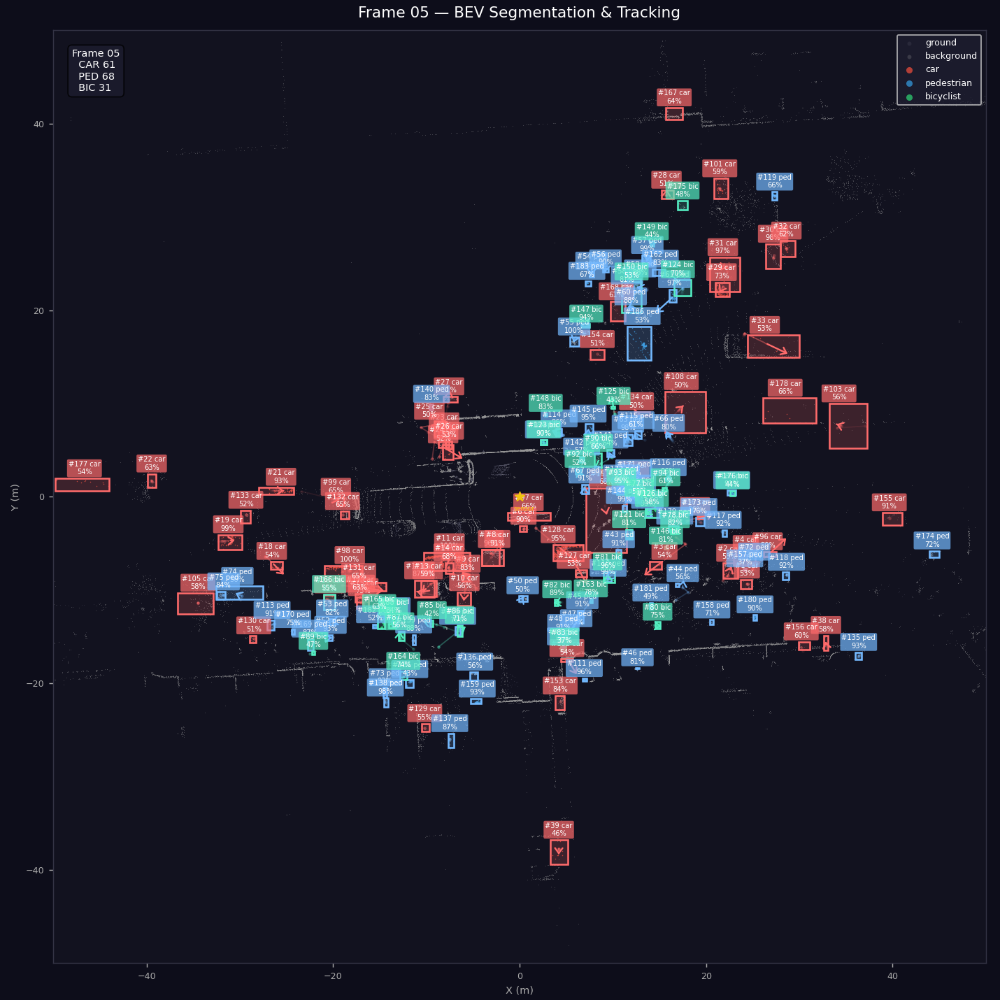
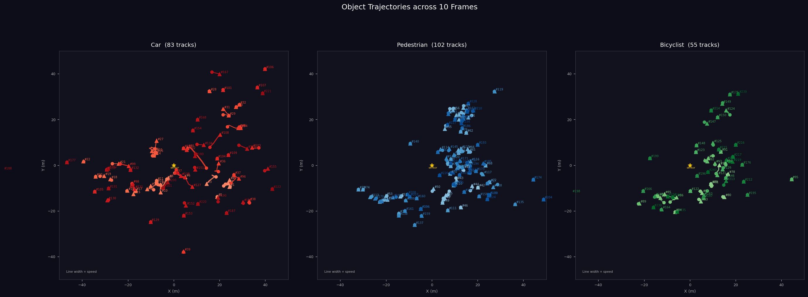

# Seoul Robotics Assignment — Report

---

## Table of Contents

1. [Dataset](#1-dataset)
2. [Methodology](#2-methodology)
3. [Evaluation Process](#3-evaluation-process)
4. [Classification Results](#4-classification-results)
5. [Discussion](#5-discussion)
6. [Optional Challenge](#6-optional-challenge)
7. [Resources and Environment](#7-resources-and-environment)
8. [Running the Code](#8-running-the-code)

---

## 1. Dataset

The dataset consists of pre-segmented LiDAR point cloud clusters across four classes: **background**, **bicyclist**, **car**, and **pedestrian**. Each sample is stored as a binary file containing 3-channel float32 values (x, y, z coordinates), with clusters already isolated from full scenes.

### 1.1 Size and Split

| Metric | Value |
|---|---|
| Total files | 52,630 |
| Train files | 42,090 |
| Test files | 10,540 |
| Total train points | 8,905,627 |
| Total test points | 2,140,190 |

### 1.2 Class Distribution

The dataset is heavily imbalanced. Background clusters dominate, making up around 77% of all samples in both splits. The two classes of primary safety interest, pedestrian and bicyclist, together account for only about 6% of the data.

**Train set (42,090 files):**

| Class | Files | Share |
|---|---|---|
| background | 32,520 | 77.3% |
| car | 7,000 | 16.6% |
| bicyclist | 1,305 | 3.1% |
| pedestrian | 1,265 | 3.0% |

**Test set (10,540 files):**

| Class | Files | Share |
|---|---|---|
| background | 8,135 | 77.2% |
| car | 1,755 | 16.7% |
| bicyclist | 330 | 3.1% |
| pedestrian | 320 | 3.0% |

The proportions are nearly identical across both splits, which indicates that the original dataset was assembled with class-proportional sampling. This consistency makes the test set a reliable proxy for real-world distribution.

### 1.3 Cluster Characteristics

Looking at the point counts and spatial extents gives a clearer picture of what each class looks like geometrically.

**Points per cluster (train set):**

| Class | Min | Max | Mean | Median |
|---|---|---|---|---|
| background | 6 | 16,022 | 173.3 | 94 |
| bicyclist | 7 | 3,790 | 299.5 | 72 |
| car | 6 | 11,130 | 372.5 | 148 |
| pedestrian | 6 | 2,449 | 214.4 | 93 |

Cars tend to have more points on average, which is consistent with their larger physical footprint and the way LiDAR beams accumulate on a broad reflective surface. Pedestrian and bicyclist clusters, while fewer points on average, show large variability; a bicyclist from a far range may produce just a handful of points, while a nearby one might produce several hundred. Background clusters have a wide range since they can represent anything from a single noise point to a dense vegetation return.

**Spatial extents (sampled from the first 20 files per class, train set):**

| Class | x range (m) | y range (m) | z range (m) |
|---|---|---|---|
| background | [-1.19, 0.92] | [-1.16, 1.04] | [-1.69, 1.44] |
| bicyclist | [-0.58, 0.72] | [-0.74, 1.01] | [-0.95, 1.98] |
| car | [-2.93, 4.46] | [-2.28, 2.06] | [-1.03, 1.15] |
| pedestrian | [-0.79, 0.74] | [-0.66, 1.02] | [-0.95, 0.90] |

Cars span the largest footprint in x and y, while bicyclists tend to have greater z extent than pedestrians, which makes sense given the combined height of a rider and bicycle. Pedestrian and bicyclist clusters are similar in their horizontal footprint, which contributes to the difficulty in distinguishing between them. Background clusters vary widely, as expected from a catch-all class covering noise, vegetation, infrastructure, and other non-object returns.

### 1.4 Train / Validation Split

The provided training set was split into a training subset and a validation subset prior to model development. This split was done with `split_data.py`, which performs a per-class stratified split to preserve the class proportions. A 70/30 ratio (random seed 42) was used, resulting in:

| Class | Train | Val |
|---|---|---|
| background | 22,764 | 9,756 |
| bicyclist | 913 | 392 |
| car | 4,900 | 2,100 |
| pedestrian | 885 | 380 |
| **Total** | **29,462** | **12,628** |

The validation set was used throughout training to track generalisation and select the best model checkpoint. The held-out test set (`data/test`) was only touched during final evaluation.

---

## 2. Methodology

### 2.1 Model — PointNet++

The classification model is based on **PointNet++** (Qi et al., NeurIPS 2017), specifically the Single-Scale Grouping (SSG) variant. PointNet++ was chosen because it is a well-established architecture for point cloud learning that processes 3D geometry directly without voxelisation or projection, making it suitable for LiDAR cluster data of the kind present in this dataset.

The architecture consists of three **Set Abstraction (SA)** layers followed by a fully connected classification head:

- **SA1**: Farthest Point Sampling selects 128 centroids. Ball query with radius 0.3 m groups up to 32 neighbours per centroid. A shared MLP `[64, 64, 128]` extracts local features.
- **SA2**: 32 centroids sampled from SA1 output. Radius 0.6 m, up to 64 neighbours. Shared MLP `[128, 128, 256]`.
- **SA3 (Global)**: All remaining points treated as a single group, producing a 1024-dimensional global feature vector via MLP `[256, 512, 1024]` and max pooling.
- **FC head**: `1024 → 512 → 256 → 4` with BatchNorm, ReLU, and Dropout (rate 0.4).

Total trainable parameters: approximately 1.46 million.

### 2.2 Input Preprocessing

Each cluster is loaded as raw (x, y, z) float32 values. Two preprocessing steps are applied:

1. **Resampling**: Each cluster is resampled to a fixed 256 points. If fewer than 256 points exist, sampling with replacement is used; if more, random sampling without replacement. This ensures uniform batch shapes.
2. **Normalisation**: The cluster is centred at the origin and scaled so the furthest point lies on the unit sphere. This makes the model invariant to absolute position and scale.

### 2.3 Training Configuration

| Parameter | Value |
|---|---|
| Epochs | 100 |
| Batch size | 32 |
| Optimiser | Adam |
| Learning rate | 1e-3 |
| Weight decay | 1e-4 |
| LR schedule | StepLR, ×0.5 every 20 epochs |
| Loss function | Cross-entropy with inverse-frequency class weights |
| Dropout rate | 0.4 |
| Random seed | 42 |

**Class-weighted loss** was used to counteract the severe class imbalance. Weights are computed as `total / (num_classes × class_count)`, which upweights the minority classes:

| Class | Weight |
|---|---|
| background | 0.3236 |
| bicyclist | 8.0674 |
| car | 1.5032 |
| pedestrian | 8.3226 |

**Data augmentation** was applied during training to reduce overfitting: random yaw rotation (uniform 0–2π), Gaussian coordinate jitter (σ=0.01, clipped at ±0.05), and random uniform scale (±10%).

---

## 3. Evaluation Process

### 3.1 Primary Metric — Macro F1-Score

Overall accuracy is not an appropriate primary metric here because the dataset is heavily imbalanced. A model that predicts "background" for every sample would achieve ~77% accuracy while being entirely useless for the safety-relevant classes. For this reason, **macro-averaged F1-score** was used as the primary metric throughout training and evaluation.

Macro F1 computes precision and recall independently for each class and averages them with equal weight regardless of class frequency. This forces the model to perform reasonably well on all classes, including the minority ones.

The best model checkpoint was saved based on the highest validation macro F1.

### 3.2 Supporting Metrics

The following metrics were also tracked:

- **Overall Accuracy (OA)**: proportion of correctly classified samples across all classes.
- **Weighted F1-Score**: F1 averaged with class frequency as weight; closer to OA on imbalanced data and reported for completeness.
- **Per-class precision, recall, and F1**: the full sklearn classification report, which gives the clearest view of per-class performance.
- **Confusion matrix**: both raw counts and row-normalised (recall per class), saved as plots at the end of training and evaluation.

Per-class recall is particularly important here. A low recall for a class means the model is missing instances of that class, producing false negatives. For classes like pedestrian and bicyclist, false negatives translate directly to missed detections of vulnerable road users, which is a safety-critical failure mode.

### 3.3 Learning Curves

Training loss, overall accuracy, and macro F1 were logged per epoch for both train and validation splits. The resulting curves are saved at `results/curves/`.

---

## 4. Classification Results

### 4.1 Training Curves

The training and validation curves below show how loss, accuracy, and macro F1 evolved over 100 epochs:

**Loss:**



**Overall Accuracy:**



**Macro F1:**



The model converged steadily. The best validation macro F1 of **0.7801** was achieved at epoch 39. After that, continued training led to slight overfitting: the train metrics kept improving while the validation macro F1 plateaued and gradually declined, which is a common pattern with a small minority class count.

### 4.2 Validation — Best Checkpoint (Epoch 39)

**Confusion matrix (validation set at best epoch):**


### 4.3 Test Set Results

The final evaluation was run on the held-out test set using the best model checkpoint. Results are reported from `evaluate.py`.

| Metric | Value |
|---|---|
| Overall Accuracy | 89.82% |
| Macro F1-Score | **0.7741** |
| Weighted F1-Score | 0.8985 |

**Per-class breakdown:**

| Class | Precision | Recall | F1-Score | Support |
|---|---|---|---|---|
| background | 0.9447 | 0.9281 | 0.9363 | 8,135 |
| bicyclist | 0.8080 | 0.6121 | 0.6966 | 330 |
| car | 0.7534 | 0.8632 | 0.8046 | 1,755 |
| pedestrian | 0.6969 | 0.6250 | 0.6590 | 320 |
| **macro avg** | **0.8007** | **0.7571** | **0.7741** | 10,540 |
| weighted avg | 0.9010 | 0.8982 | 0.8985 | 10,540 |

**Confusion matrix (test set):**



**Per-class recall summary:**

| Class | Recall |
|---|---|
| background | 0.9281 |
| car | 0.8632 |
| pedestrian | 0.6250 |
| bicyclist | 0.6121 |

Background and car are classified well, with recall above 86%. Pedestrian and bicyclist are more challenging; recall sits at 62.5% and 61.2% respectively, meaning roughly 38% of pedestrian instances and 39% of bicyclist instances are not correctly identified.

Looking at the confusion matrix, the main sources of error are:
- Background is frequently confused with car (481 background predicted as car), likely due to background clusters that resemble vehicle-shaped structures.
- Bicyclist and pedestrian have some cross-confusion with background, and bicyclist is occasionally confused with pedestrian.
- Car has relatively clean predictions: the model almost never confuses a car with a pedestrian or bicyclist.

### 4.4 Merged People Class — Supplementary Evaluation

To understand whether the confusion between pedestrian and bicyclist is a significant source of error, a supplementary evaluation was run merging both into a single "people" class. This helps isolate how well the model distinguishes object vs. non-object (background/car) from how well it distinguishes within the people category.

| Class | Precision | Recall | F1-Score |
|---|---|---|---|
| background | 0.9436 | 0.9254 | 0.9344 |
| car | 0.7529 | 0.8610 | 0.8033 |
| people | 0.7712 | 0.6585 | 0.7104 |

**Macro F1 (merged): 0.8160**

Merging the two classes raises the macro F1 by ~4 points, which shows that part of the difficulty lies in the fine-grained distinction between pedestrian and bicyclist, understandable given how similar these clusters can look in terms of size and shape.

---

## 5. Discussion

### 5.1 Class Imbalance and Choice of Metrics

The dataset is strongly imbalanced with background comprising ~77% of samples. Under these conditions, overall accuracy is a misleading metric: it is inflated by the dominant class and gives little insight into how the model handles minority classes. Macro F1 treats all classes equally and exposes exactly where the model struggles. This is why it was used as the primary evaluation metric and the checkpoint selection criterion throughout training.

Weighted loss during training plays a similar role: by assigning class weights proportional to the inverse of class frequency (up to ~8× for pedestrian and bicyclist vs. ~0.3× for background), the loss function steers the model to not simply ignore the minority classes. This visibly helps: even with 25–40× fewer training samples than background, bicyclist and pedestrian reach F1 scores in the 0.66–0.70 range.

### 5.2 Safety Implications of Lower Recall for Pedestrians and Bicyclists

In an autonomous driving or robotics perception context, recall for vulnerable road users carries more weight than precision. A false negative (a pedestrian or bicyclist that goes undetected) can have direct safety consequences. A false positive (something classified as a pedestrian that isn't) is a nuisance at worst. The current model's recall of ~62% for both classes means that in a real deployment roughly one in three pedestrians and bicyclists would be missed, which is not acceptable for safety-critical use.

This asymmetry between precision and recall for these classes should ideally be addressed explicitly: either by further adjusting the classification threshold (i.e., accepting more false positives to improve recall), or by improving the model's ability to distinguish these classes in the first place.

### 5.3 What Can Improve Pedestrian and Bicyclist Performance

Several factors contribute to the current performance gap, and addressing them could push recall meaningfully higher:

**More training data for minority classes.** With only ~900 training examples per class, the model has limited exposure to the full variability of pedestrian and bicyclist clusters. Collecting or synthesising additional samples would be the most direct improvement. Techniques like copy-paste augmentation (transplanting minority-class clusters into other scenes) could also help.

**More aggressive augmentation on minority classes.** The current augmentation (yaw rotation, jitter, scale) is applied uniformly. Applying stronger or more diverse augmentation specifically to pedestrian and bicyclist samples, including random partial occlusion or point dropout to simulate sparse long-range returns, could help the model generalise better.

**Larger or deeper model.** The current model has ~1.46M parameters with moderate capacity. A deeper or wider PointNet++ with multi-scale grouping (MSG) could learn richer features from small, sparse clusters.

**Additional input channels.** The clusters in the main dataset only contain (x, y, z). If intensity or ring-number information were available (as in the optional challenge data), these channels could provide useful discriminative cues; for instance, cyclists often have highly reflective gear, and intensity patterns differ between humans and metal structures.

**Height-based features.** Explicit geometric features such as bounding box height-to-width ratio or eigenvalue-based shape descriptors (linearity, planarity, sphericity) could be prepended as additional input channels. Cars and pedestrians/bicyclists differ substantially on these.

---

## 6. Optional Challenge

### 6.1 Dataset

The optional challenge dataset consists of 10 sequential LiDAR frames captured at what appears to be a busy pedestrian intersection. Each frame contains around 184,000 points with 5 channels per point: x, y, z, intensity, and ring number (LiDAR beam index).

| Metric | Value |
|---|---|
| Frames | 10 |
| Points per frame (min) | 183,642 |
| Points per frame (max) | 184,922 |
| Points per frame (mean) | 184,385 |
| Channels per point | 5 (x, y, z, intensity, ring) |

When visualised, the scene shows a large number of pedestrians crossing the road, several cars in static or near-static positions, and some vehicles decelerating toward the intersection. The scene is relatively dense in terms of object count, with pedestrians closely spaced in some areas. Occlusion is noticeable: point clouds of objects behind others show some distortion and truncation at the occluded edges, which makes clean cluster boundaries harder to obtain.

### 6.2 Pipeline — Initial Approach

The task required segmenting each frame into five classes (ground, background, car, pedestrian, bicyclist), clustering the object classes, and tracking them across frames. The initial pipeline (`run_pipeline.py`) is structured as follows:

1. **Ground removal**: RANSAC plane fitting (Open3D) with a 0.25 m inlier threshold. Points within this distance of the estimated ground plane are labelled ground and removed from further processing.
2. **DBSCAN clustering**: The remaining (non-ground) points are clustered using DBSCAN with `eps=0.6 m` and `min_samples=5`. Each resulting cluster is an object candidate.
3. **Cluster classification**: Each cluster is passed to the trained PointNet++ classifier (the same `checkpoints/best_model.pth` as the main task). The cluster is resampled to 256 points, normalised, and run through the model. Clusters predicted as "background" are discarded from the tracking stage.
4. **Multi-object tracking**: A SORT-style Kalman filter tracker associates detections across frames by 3D centroid proximity. A track persists for up to 3 frames without a matching detection before being removed.
5. **Outputs**: Labelled point clouds (`.npz`), per-frame tracking JSON, bird's-eye-view (BEV) visualisations, and an animated GIF are written to `optional_challenge/results/visualization/`.

**Sample output frames (initial single-pass pipeline):**

| Frame 00 | Frame 05 |
|---|---|
|  |  |

**Track trajectories (initial pipeline):**



Looking at these results, the main issue observed was that pedestrians in the scene were frequently not detected. The DBSCAN epsilon of 0.6 m was appropriate for car-sized objects but too coarse for closely-spaced pedestrians; it tended to merge multiple individuals into a single large cluster, which the classifier then either labelled as background or misclassified.

### 6.3 Pipeline — Two-Pass Approach

To address the pedestrian detection problem, an improved pipeline (`run_pipeline_two_pass.py`) was developed with the following key changes:

**1. Tighter ground removal**: The RANSAC inlier threshold was reduced from 0.25 m to 0.15 m. This preserves more of the lower leg and feet points for pedestrians, which were sometimes being absorbed into the ground plane estimate.

**2. Two-pass DBSCAN clustering**: Rather than a single DBSCAN pass, two passes are run:
   - *Fine pass* (`eps=0.35 m`, `min_samples=3`): captures tight, small-scale clusters suitable for pedestrians and bicyclists.
   - *Coarse pass* (`eps=1.4 m`, `min_samples=6`) on the points not assigned in the fine pass: recovers cars and larger structures that need a wider neighbourhood radius to cluster properly.
   
   The two cluster sets are merged with unique IDs before classification.

**3. Geometric post-filtering**: After classification, each predicted cluster is checked against class-specific bounding box bounds (e.g., a pedestrian cluster cannot be wider than 1.5 m or taller than 2.5 m). Implausible predictions are demoted to background. Oversized pedestrian clusters are re-split with an even tighter epsilon (0.25 m) and reclassified.

**4. Lower minimum cluster size**: Reduced to 5 points, so distant pedestrians with sparse returns are not silently discarded.

**Sample output frames (two-pass pipeline):**

| Frame 00 | Frame 05 |
|---|---|
|  |  |

**Track trajectories (two-pass pipeline):**



The two-pass approach improves pedestrian detection noticeably; more pedestrian clusters are found and tracked across frames. However, notable false negatives and some false positives are introduced as well (clusters that are geometrically plausible but misclassified), particularly in areas where multiple pedestrians are in close proximity and the fine DBSCAN pass still struggles to separate individuals.

### 6.4 Discussion — Limitations and Future Work

Even though the pipeline developed here works reasonably on simpler scenarios, the given data represents a genuinely challenging scene: a dense pedestrian crossing with occlusion, close spacing between people, and a mix of static and moving vehicles. The combination of classical clustering (DBSCAN) with a cluster-level classifier has inherent limitations in this setup.

If given more time, a better approach for this type of scene would be to apply a model trained end-to-end for full scene segmentation on large-scale LiDAR datasets such as **SemanticKITTI**. Models like **RandLA-Net** or **Cylinder3D** are trained on full outdoor driving scenes with dense annotation and handle occlusion and pedestrian crowds significantly better. Their per-point predictions would then feed directly into clustering and tracking, bypassing the fragile detect-then-classify separation that the current pipeline relies on.

---

## 7. Resources and Environment

All experiments were run on an Apple M2 Mac using:

- **Python 3.13** in an Anaconda environment
- **PyTorch** with MPS (Apple Silicon GPU) acceleration
- **scikit-learn** for DBSCAN clustering, RANSAC ground fitting, and metrics
- **Open3D** for RANSAC-based ground plane estimation
- **VisPy** for 3D point cloud visualisation
- **Matplotlib / Seaborn** for plots
- **filterpy / scipy** for the SORT Kalman tracker

Training took approximately 255 minutes (about 4 hours 15 minutes) for 100 epochs on the M2 MPS device.

---

## 8. Running the Code

### 8.1 Installation

```bash
pip install -r requirements.txt
```

For the optional challenge pipeline, additional packages are needed:

```bash
pip install open3d filterpy
```

### 8.2 Data Preparation

Before training, split the training set into train and validation subsets. This only needs to be run once:

```bash
python split_data.py
```

This moves 30% of each class from `data/train/` to `data/val/`, preserving class proportions.

### 8.3 Training

```bash
python train.py
```

Outputs are written to `checkpoints/` (model checkpoints) and `results/` (logs, confusion matrices, learning curves). All hyperparameters are configurable via the `GLOBAL VARIABLES` section at the top of the file.

### 8.4 Evaluation on the Test Set

```bash
python evaluate.py
```

Loads the best model checkpoint and evaluates on `data/test/`. Writes a detailed classification report and confusion matrix to `results/`.

### 8.5 Inference on New Files

Use `infer.py` to classify one or more `.bin` files with the trained model:

```bash
# Classify a single file
python infer.py data/test/pedestrian/some_cluster.bin

# Classify all .bin files in a directory
python infer.py data/test/bicyclist/

# Show per-class probabilities alongside the top prediction
python infer.py data/test/car/some_cluster.bin --probs

# Use a specific checkpoint
python infer.py path/to/cluster.bin --checkpoint checkpoints/best_model.pth
```

Output is a table with the file path, predicted class, and confidence:

```
File                                  Predicted     Confidence
------------------------------------------------------------------
data/test/pedestrian/cluster_01.bin   pedestrian        87.34%
data/test/pedestrian/cluster_02.bin   background        52.10%
```

Pass `--probs` to also see the full softmax distribution over all four classes.

### 8.6 Visualising Raw Point Cloud Data

To inspect the original pre-segmented cluster files:

```bash
python data_visualize.py
```

Set the `data_folder` variable inside the script to point to any class directory. Use `N` / `B` to navigate frames.

To view the raw 5-channel optional challenge frames (x, y, z, intensity, ring) in 3D:

```bash
python view_raw_3d.py
```

Controls: `N` / `B` to navigate frames, `C` to cycle colour modes (height, intensity, ring), `R` to reset camera, `Q` to quit. Optionally pass `--data_dir` to point at a different directory of `.bin` files.

### 8.7 Optional Challenge Pipeline

Run the initial single-pass pipeline:

```bash
cd optional_challenge
python run_pipeline.py
```

Run the two-pass improved pipeline:

```bash
cd optional_challenge
python run_pipeline_two_pass.py
```

Results are written to `optional_challenge/results/` and `optional_challenge/results_two_pass/` respectively, including segmentation data (`.npz`), per-frame tracking JSON, BEV visualisation images, and an animated GIF.

### 8.8 Viewing Optional Challenge Results in 3D

To interactively view the segmented and tracked results:

```bash
# View results from the single-pass pipeline (default):
python optional_challenge/view_results_3d.py

# View results from the two-pass pipeline:
python optional_challenge/view_results_3d.py --results_dir optional_challenge/results_two_pass
```

Controls: `N` / `B` for next/previous frame, `G` to toggle ground points, `A` to toggle background, `R` to reset camera, `Q` to quit. Mouse: left-drag to rotate, right-drag to zoom, middle-drag to pan.
